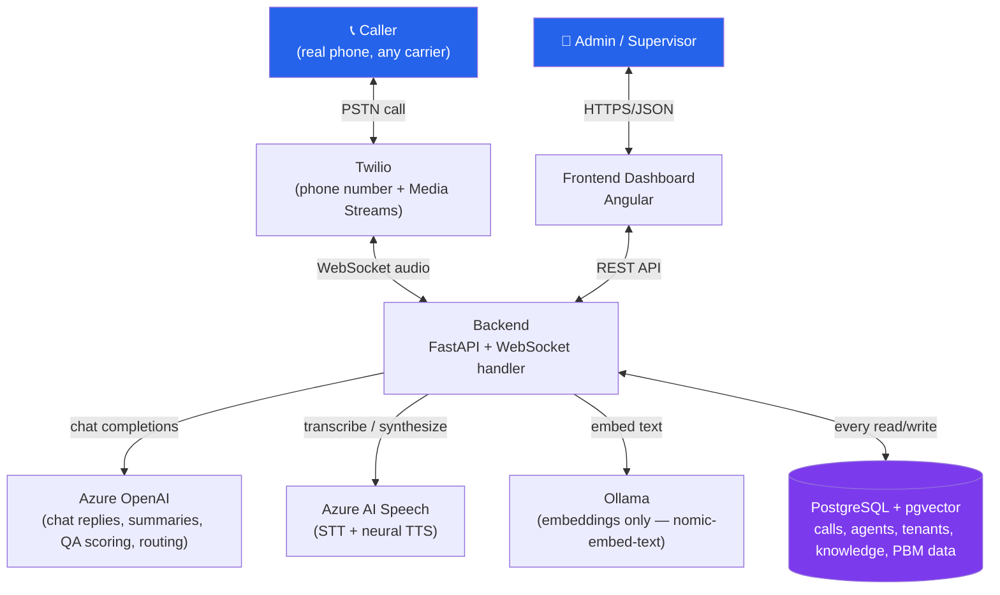
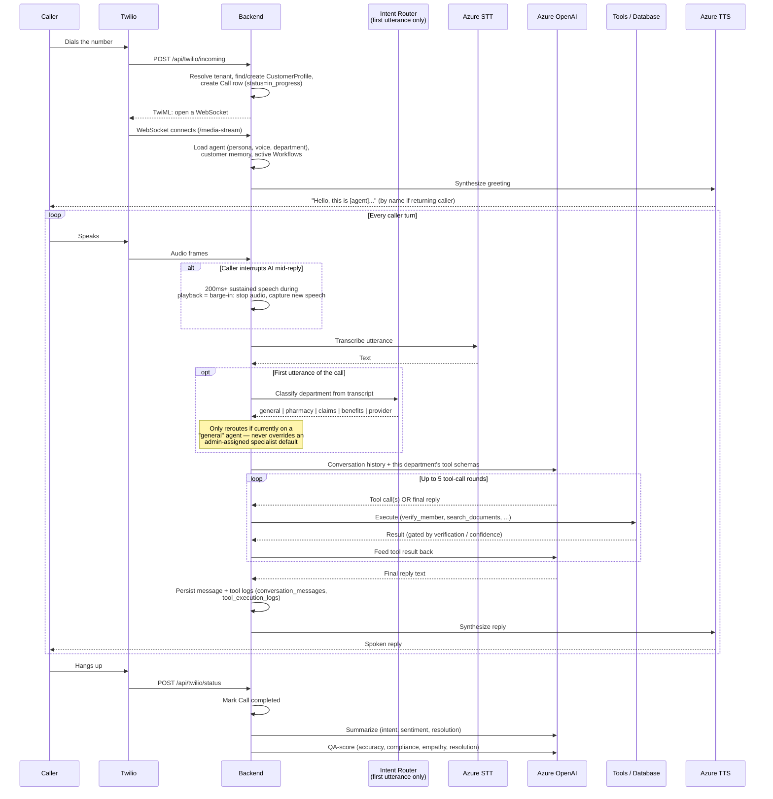
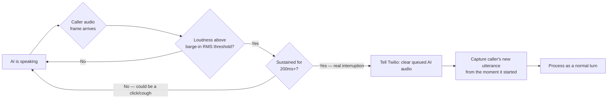

# Platform Guide — Complete Workflow & Feature Reference

A single reference for how this platform actually works end-to-end, and what every feature/page is for and who uses it. Written from the real code, not an idealized design — where something has a real limitation or caveat, it's called out rather than smoothed over.

---

## 1. System architecture — the big picture

**Why each piece is there:**
- **Twilio** — the only piece that touches the real telephone network (PSTN). No open-source substitute exists for "a phone number a real caller can dial."
- **Azure OpenAI** — the conversational brain: decides what to say, which tools to call, writes call summaries, scores QA, classifies intent for routing.
- **Azure AI Speech** — turns caller audio into text (STT) and replies into audio (TTS), using neural voices so it doesn't sound robotic.
- **Ollama (`nomic-embed-text`)** — the one piece still self-hosted. Only used to turn uploaded documents and caller questions into vectors for knowledge-base search — cheap and not latency-critical on a live call, so it didn't need to move to Azure.
- **PostgreSQL + pgvector** — one database for everything: call records, agent configs, tenant isolation (Row-Level Security), and the vector search that powers the knowledge base.

---

## 2. The complete call workflow

**Key real behaviors baked into this loop:**
- The LLM can call **up to 5 tools in a row** before it must produce a reply — e.g. verify → look up claim → check formulary, all before speaking. If it's still stuck after 5 rounds, it falls back to *"I'm having trouble finding that. Let me connect you to a human."*
- **Verification is a hard gate, not a prompt suggestion.** Tools like `check_claim_status` and `get_benefits` check `verified_member_id` in code — if it's `None`, the tool itself returns `[VERIFICATION REQUIRED]` and refuses to touch the database, regardless of what the LLM was told to do.
- **Department-scoped tools.** A specialist agent isn't just *told* to stay in its lane — `tools_for_department()` only hands the LLM the tool schemas that department is allowed to see. It's architecturally impossible for it to call a tool outside its remit.
- A **supervisor's "Stop AI"** (Live Operations) is checked at the very top of every turn — if set, the LLM is skipped entirely and a hold message is played instead. A **"Send suggestion"** gets folded into the conversation as a one-time system note, then discarded after one turn.

---

## 3. Barge-in (interruption handling)

The loudness bar during AI playback is set **higher** than during normal turn-taking on purpose: a caller on speakerphone can have the AI's own voice leak back into their mic as echo, and a higher threshold makes that leaked echo less likely to falsely trigger a cutoff than genuine direct speech. Tunable via `BARGE_IN_MS` / `BARGE_IN_RMS_THRESHOLD` without a code change.

---

## 4. Feature reference — what each thing is for, and who uses it

Each entry: **what it is** → **why it exists** → **primary role**.

### Dashboard
Live snapshot: active calls right now, resolution rate, estimated cost saved (explicitly an *estimate*, not real accounting), recent conversations.
**Role:** Business owner / ops manager — the "how's it going today" view.

### Agent Studio
Where you create and configure an AI persona: name, voice (a real Azure neural voice, e.g. `en-US-JennyNeural`), department, persona text (tone/style — shapes the system prompt, doesn't add facts), and the knowledge base (upload PDF/DOCX here).
**Role:** Admin / configurator — this is the main "build the CSR" screen.

### Knowledge base / RAG (inside Agent Studio)
Uploaded documents are parsed, split into chunks along paragraph boundaries, embedded via Ollama, and stored with a pgvector column. On a call, the AI searches these chunks by cosine similarity against the caller's question — it never answers from general knowledge, only from what's actually retrieved.
**Role:** Admin — this is how you teach an agent facts without touching code.

### Confidence Engine
Every knowledge lookup gets a 0–100 score based on how close the best-matching chunk is. **≥75% → answer directly. 53–74% → answer, but hedge and cite the source. <53% → refuse and escalate**, never guess. *(These exact cutoffs were recalibrated on 2026-08-22 after a real test call showed the previous 90/70 thresholds — inherited from a different embedding model — were wrong for `nomic-embed-text`'s actual score range. See `app/confidence_service.py` for the reasoning and `docs/validation/evidence_requirements.md` for the honest caveat: this is real-data correction, not a full validated calibration study.)*
**Role:** Invisible to end users — this is the safety mechanism that keeps the AI from hallucinating.

### Citations
Every knowledge-grounded reply records which document/page it came from, shown as chips under the message in the transcript — visible to a supervisor reviewing the call, never read aloud to the caller.
**Role:** QA / compliance reviewer — the audit trail for "why did it say that."

### Live Operations (Supervisor Command Center)
Real-time list of in-progress calls (refreshes every 4s). A supervisor can:
- **Monitor** — open the live transcript as it happens
- **Stop AI** — the AI immediately stops replying and plays a hold message until resumed
- **Send suggestion** — a note folded into the AI's *next* reply only, then discarded

*Not implemented: Join call / Transfer call — both need real Twilio audio-bridging that hasn't been built/tested.*
**Role:** Live supervisor — the "step in if something's going wrong" screen.

### Conversations
Every call's full transcript (customer/assistant bubbles + tool-execution cards), searchable, with resolution/sentiment badges and the post-call summary + QA scores.
**Role:** QA / compliance reviewer, or anyone auditing what actually happened on a call.

### Customers
Every caller ever seen, with call history and derived sentiment — a live join over `calls`, nothing duplicated or stored twice.
**Role:** Support/ops — "what's this person's history with us."

### Workflows (Workflow Engine)
Admin-defined procedures: a name, a trigger description (when it applies), a department scope, and an ordered list of tools to call. Active workflows for the current department get injected into the AI's system prompt as a mandatory sequence.
**Important real caveat:** not every tool is available to every department (see `app/tools/department_tools.py`) — a workflow step using a tool outside its department's allowed set simply can't run. Always check the department's real tool list before designing a workflow.
**Role:** Admin — encodes "when X happens, always do Y then Z" without needing a code change.

### Multi-Agent routing
On a caller's **first utterance only**, an intent classifier (a small LLM call) decides whether to hand off from a `general` department agent to a specialist (pharmacy/claims/benefits/provider) — invisibly, mid-call, transcript stays intact. Two real rules: it **only** reroutes away from a `general` agent (an admin-assigned specialist default is never second-guessed), and it only runs at all if the tenant has more than one distinct department configured.
**Role:** Invisible to callers — lets one phone number serve multiple specialties without the caller having to "press 1 for..." anything.

### PBM / healthcare tools
`verify_member`, `check_claim_status`, `get_benefits`, `search_formulary`, `find_pharmacy`, plus `create_ticket`, `schedule_callback`, `send_email`, `update_customer`, `search_documents`, `schedule_appointment`, `escalate_to_human`. The five PBM-data tools sit behind a swappable provider interface (`PBMProvider`) rather than hardcoded queries — the seeded Postgres data is the dev/test implementation, proven substitutable with a mock implementation via automated tests. Claim/benefit lookups are **hard-gated** behind `verify_member` (member ID + DOB + ZIP) at the code level, not just prompt instruction.
**Role:** The actual "do real work" layer — this is what makes it a CSR agent instead of a chatbot.

### Analytics
Top intents, sentiment mix and its trend over time, resolution trend over time — computed live from real call data, nothing precomputed or faked.
**Role:** Business/ops manager — the trend view behind the Dashboard's snapshot.

### AI Training Center
On demand ("Run analysis"), scans **recent real calls** for recurring patterns in low-confidence answers, escalations, and low-QA-scored calls, and suggests concrete fixes (upload this document / adjust this behavior). Has nothing to analyze until real calls have actually happened — it's not a pre-training step.
**Role:** Admin/ops — the "how do we get better" feedback loop, driven by evidence not guesswork.

### Data Import
Bulk-import real member/claim/formulary/pharmacy data from a CSV — upload, map columns to fields, preview, import. Re-importing the same file updates existing records instead of duplicating them.
**Role:** Admin/data owner — how real PBM data actually gets into the system at volume, instead of one-by-one.

### Security (cross-cutting, no dedicated page)
Multi-tenant Row-Level Security enforced *by Postgres itself* (not just app code) — every tenant-owned table is scoped to `current_setting('app.current_tenant_id')`, so even a code bug can't leak one business's data into another's. JWT auth, bcrypt password hashing, per-IP rate limiting on auth endpoints.
**Role:** Invisible, but the reason a multi-tenant version of this is safe to run at all.

---

## 5. Roles at a glance

| Role | Primarily uses |
|---|---|
| **Admin / configurator** | Agent Studio, Workflows, Data Import |
| **Live supervisor** | Live Operations |
| **QA / compliance reviewer** | Conversations, Citations, QA scores |
| **Business / ops manager** | Dashboard, Analytics, AI Training Center |
| **Support staff** | Customers |
| **Caller (end user)** | Never sees the dashboard at all — only ever experiences the phone call itself |
| **Developer** | Everything above, plus the PBM provider interface, the evaluation framework (`app/evaluation/`), and the validation docs under `docs/validation/` |

---

## 6. What this document does and doesn't claim

This describes how the system is **built to behave**, verified against the actual code as of 2026-08-22 (including the real confidence-threshold bug found and fixed during live testing that day). It is not a substitute for `docs/validation/evidence_requirements.md`, which tracks what's actually been proven at scale with real calls versus what's still architecture-only. Concurrency, multi-agent load, and most PBM/accuracy claims remain `UNKNOWN` in that sense even though the mechanisms described here are real and tested at the unit/integration level.
